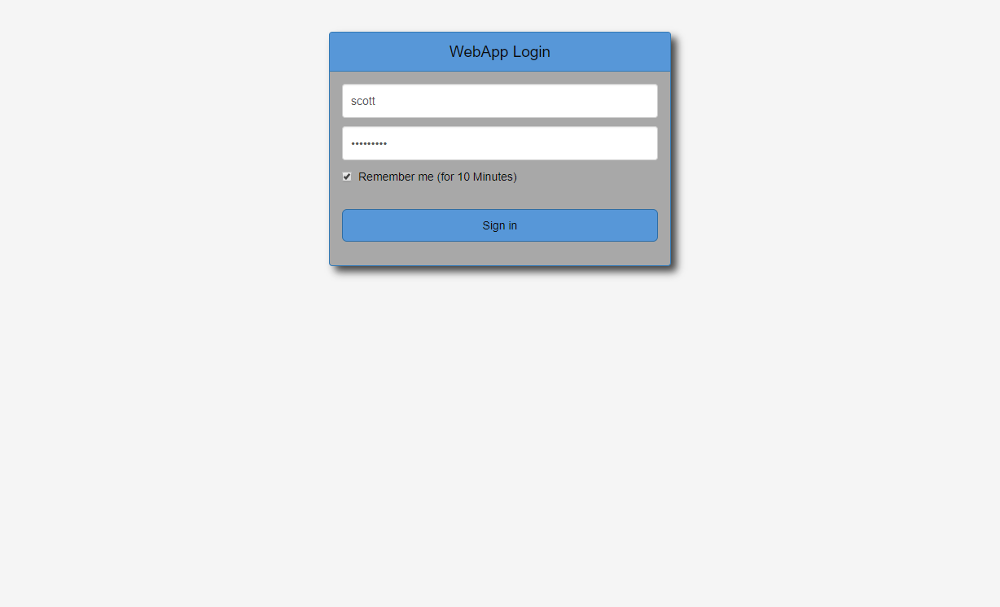
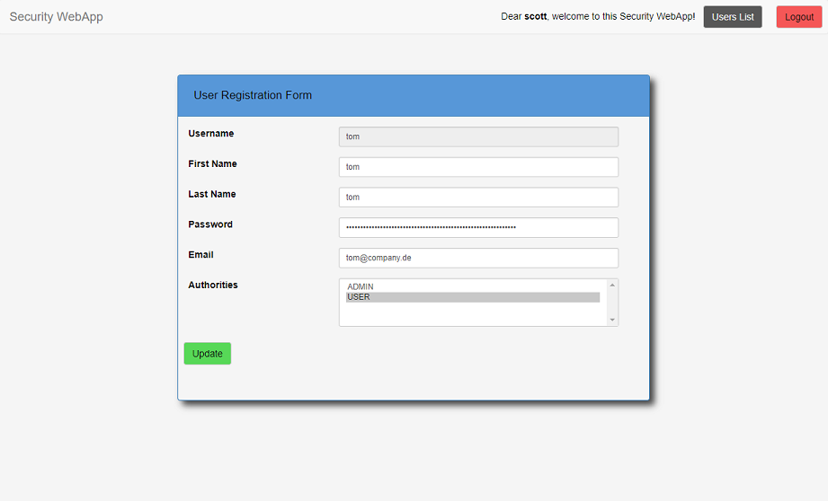

# Spring Security Hibernate Login - WebApp

This is just a sample Spring Security Login WebApp with Hibernate. 

## Usage
* first build the app: `./mvnw clean install`
* create a database with the startup scripts (i recommend a mysql docker container)
* if needed - adjust application.properties file (databse port / database user)
* then deploy it to the root of a tomcat server
* start with [http://localhost:8080/](http://localhost:8080/)
* login with username "scott" and password "scotty123"

## Screenshots
* Login

* Users List

* New User

* Edit User

## Technologies
This WebApp shouldn't win a design award. but it brings some technologies together: 
* Frontend is written in JSP with bootstrap CSS 
* Communication via REST-Endpoints 
* Backend is written in Spring 
* Login functionality via Spring Security 
* Remember me functionality via HibernateTokenRepository (store token in database) 
* ORM mapping via Hibernate/JPA 
* mysql database 

## Contribution
You are welcome to contribute this project! Please follow the standard rules. 
If you find a bug or have an idea for improvement, then please firstly open an issue. 
Thank you. 

## P.S.
This project is just to improve my spring/jsp skills and to "store" some best practices 
like PersistenceConfig/SecurityConfig or the behaviour of the JPA repositories. 

## Copyright and License
Copyright :copyright: 2017 Michael Wellner ([@m1well](http://www.twitter.m1well.de)) 
Code released under the [MIT License](/LICENSE). 
